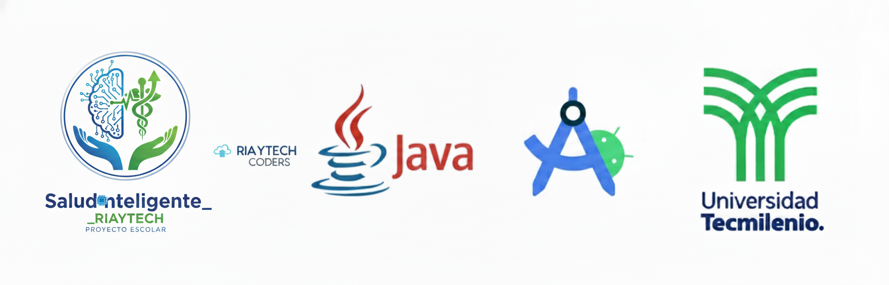

---

🩺 Salud Inteligente - por RIAYTECH Solutions F
Aplicación Android con flujo de Login, registro en una base de datos SQLite local y un Dashboard de bienvenida.

---

🚀 Cómo Abrir en Android Studio
Se recomienda usar Android Studio Narwhal (4 - 2025.1.4) o una versión superior.

Descarga y extrae el archivo .zip en tu equipo.

Abre Android Studio y selecciona File -> Open...

Navega y selecciona la carpeta raíz del proyecto (SaludInteligente_RIAYTECH).

Espera a que Gradle sincronice todas las dependencias. Si el IDE te solicita actualizar el plugin de Gradle o el SDK, sigue las indicaciones en pantalla.

Ejecuta la aplicación en un emulador o en un dispositivo físico.

---

📦 Generar un APK (desde Android Studio)
En el menú superior, ve a Build -> Build Bundle(s) / APK(s).

Selecciona Build APK(s).

Una vez que la compilación termine, aparecerá una notificación. Haz clic en Locate para encontrar el archivo app-debug.apk.

---

💻 Compilar desde Terminal
Si prefieres compilar usando la línea de comandos (ideal para CI/CD o scripts):

Abre tu terminal (o CMD/PowerShell en Windows).

Navega hasta la carpeta raíz del proyecto (SaludInteligente_RIAYTECH).

Ejecuta el wrapper de Gradle:

En Linux / Mac:

Bash

./gradlew assembleDebug
En Windows:

Bash

gradlew assembleDebug
El APK compilado se encontrará en la siguiente ruta:

app/build/outputs/apk/debug/app-debug.apk

---

📋 Requisitos Previos
Asegúrate de tener el siguiente entorno configurado, especialmente si compilas desde la terminal:

☕ JDK 11 o superior.

🤖 Android SDK.

🌎 La variable de entorno ANDROID_HOME debe estar configurada correctamente.
